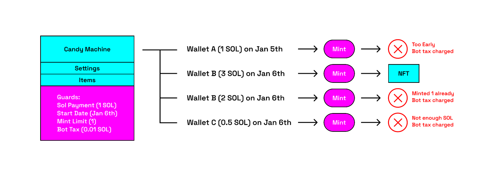

**Metaplex** is a decentralized protocol built on the Solana blockchain designed to simplify the creation, sale, and use of [NFTs](./non-fungible-tokens.md). By offering a suite of development tools, smart contracts, and open standards, Metaplex enables NFT communities to issue, manage, and own digital assets on-chain.

Metaplex continuously develops and maintains several programs and standards to enhance user experience and meet the evolving needs of its community.

## Candy Machine

Candy Machine is one of the Metaplex protocols. It is a minting and distribution program for fair NFT collection launches on Solana. Much like its name suggests, you can think of a Candy Machine as a temporary structure which is first loaded by creators and then unloaded by buyers. It allows creators to bring their digital assets on-chain in a secure and customizable way.

!!! note

    The name refers to the vending machines that dispense candy for coins via a mechanical crank. In this case the candy are NFTs and the payment is SOL or a SPL token.

!!! info

    By September 2022, 78% of all NFTs on Solana were minted through Metaplex’s Candy Machine.

Here are some of its features:

- Accept payments in **SOL**, **NFTs** or any **Solana token**.
- Restrict your launch via **start/end dates**, **mint limits**, **third party signers**, etc.
- Protect your launch against bots via **configurable bot taxes** and **gatekeepers** like captchas.
- Restrict **minting to specific NFT/Token holders** or to a **curated list of wallets**.
- Create **multiple minting groups** with **different sets of rules**.

