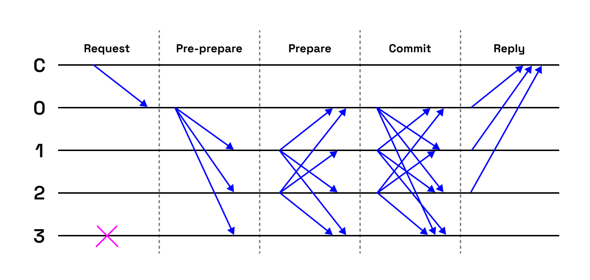

# Tower BFT (TBFT) –⁠ PoH-based PBFT

As a consensus algorithm, Solana uses the Tower BFT (TBFT), which is a custom implementation of the well-known Practical Byzantine Fault Tolerance (PBFT) algorithm published in 1999 by Miguel Castro and Barbara Liskov.
PBFT consensus rounds are divided into three main phases (pre-prepare, prepare and commit). A detailed description is beyond the scope of this handbook.

PBFT is focused on satisfying the properties of safety (results are valid and identical at all non-faulty nodes) and liveness (nodes that don’t fail always produce a result). The safety guarantee is possible due to the deterministic nature of the process (executed on every node). The liveness guarantee is possible due to the View-change process. The network will not be stopped unless there are too many byzantine nodes. View-change allows nodes to switch leaders if they appear to be malicious or faulty.

## View-change

View-changes are carried out when a leader appears to have failed, and so another node attempts to take his place by initiating an election process. It gets triggered by timeouts that prevent nodes from waiting indefinitely for requests to execute.
In addition, the timeout is postponed whenever the protocol detects that nodes are reaching an agreement on the current block.

## TBFT vs. PBFT

TBFT is a derivation of PBFT, which differs in one fundamental thing. PoH provides a global source of time before consensus is reached and can therefore be used to enforce the exponentially-increasing timeouts introduced in the original PBFT algorithm. No messages are needed as the PoH itself enforces them.

The procedure is as follows. Voting on a new block is restricted to a fixed time period counted in hashes, this unit of time is called a slot. At the moment and with the current network settings, if we convert the number of PoH hashes to time, it is approximately 400ms for one slot. Thus every 400ms, a new potential rollback point occurs, but each new block that is voted on doubles the amount of time the network would have to stall before unrolling the original vote.

Consider that each validator has voted 32 times in the last few ~12 seconds (32 · 0.4). The vote 12 seconds ago now has a timeout of 232 slots, which converted to years with a constant time of a slot of 400ms, is roughly 54 years (232 · 0.4/86400/365). A transaction with 32 confirmations is also considered finalized.
