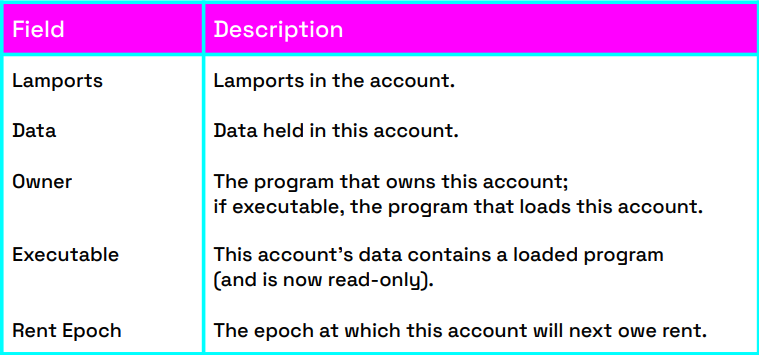

Just as in UNIX "everything is a file", in Solana "everything is an account". In other words, an account is a memory buffer, an equivalent of a file in any file system. Its main purpose is to store states between instructions and transactions. An address often referred to as a public key or pubkey, is used to look up an account. Solana’s account system can therefore be considered a key-value database system.

**The key may be one of the following:**

- An ed25519 public key.
- A program-derived account address or in short as PDA (32byte value forced off the ed25519 curve).
- A hash of an ed25519 public key with a 32-character string

**The structure of an account is shown in the following table:**

1. Lamports
    - Balance of the account in lamports.
    - 1 lamport = 10−9 SOL.
2. Data
    - Vector of bytes.
    - Maximum size of 10 MB (10 KB for PDAs).
3. Owner
    - The owner is a program id or a loader in case of an executable account.
    - If the owner matches the program id, the program is granted write access. Otherwise, it is only permitted to read its data and credit the account.
    - All new accounts are owned by the System program that allows transfers of lamports, allocating data, and assigning ownership to a different program id.
    - An account is always owned by a program or a loader.
4. Executable
    - Turning a non-executable account into an executable one is a one-way only operation.
    - The account becomes read-only.
    - The owner of such an account is a loader that will load the code from the data field of the account and start executing it if invoked.
5. Rent Epoch
    - For keeping accounts alive on Solana incurs a fee called rent.
    - An account is considered rent-exempt if it holds at least two years’ worth of rent.
    - Rent Epoch is the epoch number when the runtime checks again whether the account should pay rent or is rent-exempt.

## Account Types

**There are three basic types of accounts on Solana. Note that this is not any sort of official
classification.**

1. Data accounts storing data or user wallets with an empty data field
    - Program owned PDA (Program Derived Address) accounts
    - System owned accounts..
2. Program accounts storing user-deployed executable bytecode.
3. Native accounts indicating native programs or special runtime accounts.
    - System – lamports transfers, data allocation and ownership assignment.
    - BPF Loader – uploading and launching executable programs.
    - BPF Upgradeable Loader – uploading and launching of upgradeable executable programs.
    - Stake – program for staking SOL as a part of Proof-of-Stake mechanism.
    - Vote – program for voting as a part of the Tower BFT consensus.
    - Native Loader – the owner of native programs and their loader.
    - and more . . .