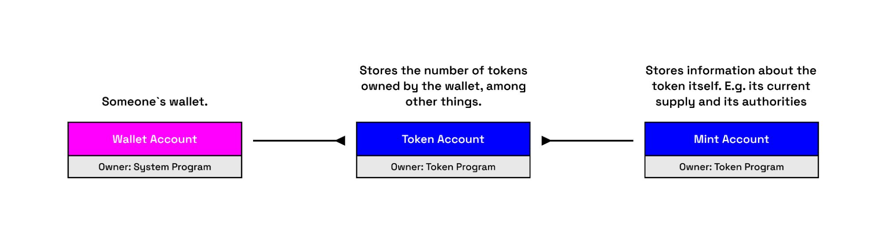

A token account on Solana is a general term for any account that holds tokens. Token accounts are created by the Token Program and store different types of tokens. Every account has a unique mint address, and a token account holds tokens of a specific mint account.

The Token Program is the owner of a token account. However, another account can be specified as the authority with the ability to transfer tokens. This means that while the Token Program manages the structure of the token account, another account controls the movement of tokens.

## Token Account Structure

The structure of a token account resembles that of a regular account. It holds **lamports**, has an **executable** flag (set to false), **owner** (Token Program) and stores additional **data**.

These data fields provide enhanced account management features. For example, you can specify a **delegate** account, which can then spend tokens up to a **delegated_amount**.

Main fields:

- **Mint**: The type of token the account holds.
- **Owner**: The account with authority to transfer the tokens.
- **Amount**: The number of tokens the account holds.

Additional fields:

- **Delegate**: Delegate authority having possession over delegate amount. (Optional)
- **IsNative**: Specifies whether the token account holds [wrapped SOL](https://spl.solana.com/token#wrapping-sol). (Optional)
- **Delegate amount**: Amount authorized by the delegate authority.
- **Close authority**: Authority able to close the token account. (Optional)

## Associated Token Account

An Associated Token Account (ATA) is a token account, but its address has a special property.

!!! important

    An Associated Token Account address is derived (as a PDA) from its **owner's wallet address** and the **address of the mint**.

This means that user has a different ATA for every wallet and token mint combination. This is very convenient because programs can easily find and interact with the correct account without needing the user to provide the address.

!!! info

    A user can receive tokens even if they do not yet have a token account for that mint. The **sender is able to fund the creation of the receiver's ATA**, enabling things like airdrop campaigns.

[Associated Token Account Program](https://spl.solana.com/associated-token-account) facilitates the creation and management of ATAs.
